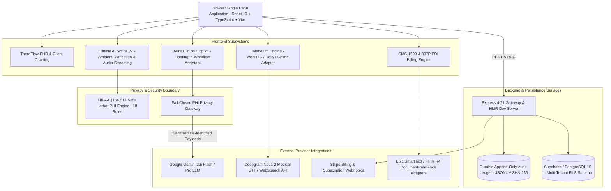

# TheraFlow OS — Architecture Specification

> **Target Audience:** Acquirer Engineering Leadership, System Architects, & Due Diligence Teams  
> **Operational Status:** Turnkey Behavioral Health Frontend & Workflow Engine (Synthetic Data / Evaluation Mode)  
> **Classification:** Acquisition-Ready Software Asset  

---

## 1. High-Level Architectural Overview

TheraFlow OS is architected as an **AI-native, privacy-centric behavioral health clinical operating system**. It decouples intensive clinical frontend interactions (ambient diarization, EHR note synthesis, telehealth, and DSM-5 / CPT billing crosswalks) from production backend infrastructure. This architecture enables an acquiring healthcare software company or EHR vendor to rapidly integrate the frontend and clinical engines directly into their existing compliant backends, databases, and customer deployments.



---

## 2. Frontend Subsystems Architecture

The client application is built with **React 19, TypeScript 5.8, Tailwind CSS v4, Lucide React, and Vite**.

### 2.1 Component Hierarchy & Context Isolation
- **`ClinicalContext` (`src/context/ClinicalContext.tsx`)**: Central state container holding synthetic active patient charts, active encounters, draft notes, DSM-5 differentials, and cross-suite navigation signals.
- **`AuthContext` (`src/lib/auth-context.tsx`)**: Manages clinician session tokens, RBAC roles (`clinical_admin`, `supervising_therapist`, `staff_therapist`, `billing_specialist`), and active practice tenancy.
- **`SubscriptionContext` (`src/lib/subscription.tsx`)**: Tracks subscription tier entitlements (`starter`, `pro`, `group`) with client-side feature gating backed by server verification.
- **`DemoGuideContext` (`src/lib/demo-guide-context.tsx`)**: Drives buyer-guided product tours across all 4 major application workflows with zero real-patient onboarding.

### 2.2 Core Suites
1. **TheraFlow EHR & Clinical Calendar (`src/tools/theraflow/`)**:
   - Patient chart views, vitals, problem list, treatment plan milestones, and appointment scheduler.
   - Cross-practice multi-site switcher with full UI tenant separation.
2. **Clinical AI Scribe v2 (`src/tools/scribe/`)**:
   - Dual-channel real-time audio visualization, speaker turn diarization (clinician vs. patient), ambient recording session timer, and multi-template generation (SOAP, DAP, Intake H&P).
   - Multi-EHR export adapters for Epic SmartText, Epic FHIR R4 `DocumentReference`, Cerner Millennium, and AthenaHealth.
3. **Telehealth Studio (`src/tools/theraflow/TelehealthView.tsx` & `webrtc-provider.ts`)**:
   - WebRTC media session provider with microphone/camera stream capture, loopback peer connection, hardware track muting, session duration timer, and CPT billing threshold tracker (CPT 90834 vs 90837).
4. **Aura Clinical Copilot (`src/tools/aura/`)**:
   - Draggable floating drawer, contextual chart analysis, DSM-5 differential diagnostic queries, and clinical phrasing suggestions.
5. **Billing, Superbill & CMS-1500 Engine (`src/components/billing/`)**:
   - Interactive CMS-1500 HCFA claim preview, box-by-box electronic claim editor, ASC X12 837P EDI raw transmission generator, and 277CA claim scrubber.

---

## 3. Backend & Persistence Architecture

### 3.1 Node / Express Server Gateway (`server.ts`)
- **Port & Host**: Runs on port 3000 (configurable via `process.env.PORT`).
- **Development Mode**: Mounts Vite in middleware mode for hot module replacement (HMR).
- **Production Mode**: Serves pre-compiled production SPA assets from `dist/` with fallback routing to `index.html`.
- **API Surface**:
  - `POST /api/telehealth/meeting`: Generates WebRTC session credentials.
  - `GET /api/audit-logs`: Retrieves immutable audit events with pagination and MRN filtering.
  - `POST /api/audit-logs`: Records client-side and server-side clinical access actions into the append-only ledger.
  - `GET /api/audit-logs/export`: Exports tamper-evident audit history in JSON or CSV format.
  - `POST /api/billing/create-checkout`: Stripe checkout session creation.
  - `GET /api/billing/checkout-session`: Retrieves and reconciles Stripe payment status.
  - `POST /api/subscription/verify`: Server-authoritative token and entitlement validation.

### 3.2 Durable Append-Only Cryptographic Audit Ledger (`data/audit_ledger.jsonl`)
- Audit persistence is backed by an append-only JSON Lines ledger on disk.
- Each record calculates a SHA-256 hash using the formula:
  $$\text{Hash}_n = \text{SHA256}(\text{PrevHash}_{n-1} \parallel \text{ID} \parallel \text{Timestamp} \parallel \text{Actor} \parallel \text{Action} \parallel \text{MRN} \parallel \text{IP} \parallel \text{Details})$$
- The server performs cryptographic verification on startup, validating the unbroken hash chain from the genesis block ($000000\dots00$).

### 3.3 Production-Grade Multi-Tenant Database Schema (`supabase/migrations/20261005_init_schema.sql`)
A complete PostgreSQL 15 schema is defined for acquirer deployment into Supabase or self-hosted PostgreSQL:
- **`practices`**: Root tenant table supporting multi-site group practices with NPI, taxonomy, and practice settings.
- **`users`**: Clinician and staff identity with foreign key to `practices` and RBAC roles.
- **`clients`**: Patient demographic records isolated by `practice_id`.
- **`encounters`**: Clinical sessions tied to client, clinician, and practice, tracking CPT codes and encounter status.
- **`clinical_notes`**: Signed and draft notes with versioning, SOAP fields, and signature timestamps.
- **`billing_claims`**: CMS-1500 and 837P claim lifecycle tracking (`draft`, `scrubbed`, `submitted`, `paid`, `denied`).
- **`audit_logs`**: Database-level immutable audit records with `prev_hash` chaining.
- **Row Level Security (RLS)**: Enforces strict tenant isolation across all tables using `practice_id = auth.jwt() ->> 'practice_id'`.

---

## 4. Privacy Gateway & AI Pipeline Architecture

```
Raw Clinical Text / Voice Transcript
               │
               ▼
┌────────────────────────────────────────┐
│   Safe Harbor 18-Rule De-Identifier    │
│   (src/tools/phi-scrubber/engine.ts)   │
└────────────────────────────────────────┘
               │
               ▼
┌────────────────────────────────────────┐
│     Fail-Closed Privacy Gateway        │
│   (phi-privacy-gateway.ts)             │
│   - Direct identifier post-check       │
│   - Context MRN / Name validation      │
│   - Abort on any sanitization error    │
└────────────────────────────────────────┘
               │
       ┌───────┴───────┐
   Pass Sanitized    Leak / Exception
       │               │
       ▼               ▼
┌─────────────┐ ┌────────────────────────┐
│ External    │ │ Fall-Closed Local Rule │
│ Gemini LLM  │ │ Deterministic Engine   │
└─────────────┘ └────────────────────────┘
```

1. **Local Safe Harbor Execution**: All 18 statutory HIPAA §164.514 Safe Harbor categories are scrubbed client-side prior to outbound transmission.
2. **Fail-Closed Guardrails**:
   - The gateway rejects any outbound payload if known patient identifiers (name, MRN, phone) persist post-scrubbing.
   - If an internal parser fault occurs, the gateway throws `PhiSanitizationError` and falls back to deterministic local rule-based templates.
3. **Outbound Interception**: Both `ai-template-generator.ts` and `ai-note-expander.ts` route all external Gemini calls exclusively through `sanitizeForOutboundLlm()`.

---

## 5. Deployment Model

- **Containerization**: Single container capable of running the compiled Express server and serving client assets.
- **Environment**: Node.js 18+ / 20+ / 22+ LTS.
- **Zero-Dependency Demo Mode**: Works immediately in development or staging without external API keys via high-fidelity synthetic fallbacks.
- **Production Activation**: Connects to acquirer’s Supabase, Stripe, and STT/LLM vendor credentials via simple environment variable configuration.
