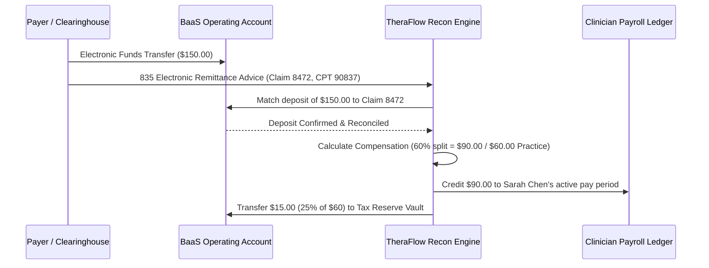

# TheraFlow OS — Embedded Business Banking (BaaS) Architecture

## 1. Executive Summary & Regulatory Boundary

**TheraFlow is NOT a chartered bank, insured depository institution, money transmitter, or custodian of customer funds.**

TheraFlow Money is built as an **Embedded Finance / Banking-as-a-Service (BaaS) abstraction layer**. It provides group practice owners with an integrated operating treasury experience while partnering underneath with regulated, FDIC-insured banks (such as Evolve Bank & Trust, Column, or Lead Bank via BaaS platforms like Unit, Stripe Treasury, or Treasury Prime).

```
+--------------------------------------------------------------------------+
|                        THERAFLOW MONEY EXPERIENCE                        |
|                                                                          |
|  [Operating Balance: $78,420]   [Tax Reserve: $19,605]   [AR: $12,450]   |
|                                                                          |
|  Unit Economics Waterfall:                                               |
|  Revenue ($42.6k) - Clinician Comp ($23.4k) = Gross Margin ($19.2k / 45%)|
|  Less OpEx ($4.8k) = Net Operating Cash Flow (+ $14.3k)                  |
+--------------------------------------------------------------------------+
                                     |
                  BusinessBankingProvider Interface (BaaS)
                                     |
    +--------------------------------+--------------------------------+
    |                                |                                |
    v                                v                                v
[TheraFlow Sandbox Treasury]    [Unit / Stripe Treasury]      [Column / Direct]
 (Deterministic FDIC Sim)         (BaaS Partner - Buyer)    (API Banking - Buyer)
    |                                |                                |
    +--------------------------------+--------------------------------+
                                     |
                                     v
                 [Underlying Regulated Partner Bank: FDIC Insured]
```

---

## 2. Multi-Vault Account Architecture

Every practice tenant is provisioned with three segregated logical accounts:

1. **Operating Checking Account**:
   - Primary account receiving all electronic remittance advice (ERA / 835) insurer deposits and patient private-pay credit card settlements.
   - Disburses practice operating expenses and ACH payroll funding debits.
2. **Automated 25% Tax Reserve Vault**:
   - Automated sub-account designed to protect behavioral health practice owners from quarterly federal and state tax surprises.
   - Whenever practice profit is realized (from an insurance claim or private-pay card settlement), the engine automatically executes an internal ledger transfer of 25% of practice retained profit into this reserve vault.
3. **Payroll Escrow Sub-Account**:
   - Holds quarantined funds during biweekly payroll processing prior to ACH direct deposit distribution to clinicians.

---

## 3. Claim-to-Bank Reconciliation Engine

A central product differentiator of TheraFlow OS is the **automated claim-to-deposit reconciliation**:



### Idempotency & Overpayment Protection
- Insurers frequently retransmit 835 remittance files or make retroactive payment adjustments.
- The reconciliation engine tracks claim IDs in a deduplication cache (`payment_reconciliations`).
- If an already reconciled claim event is re-ingested, the engine detects the prior match, logs a duplicate audit event, and halts downstream compensation credits, preventing double-paying clinicians.

---

## 4. Private-Pay Workflow

For out-of-network and self-pay practices:
1. Patient card on file is charged $200.00.
2. Payment settles into the operating checking account.
3. The clinician compensation split (e.g., 60% = $120.00) is calculated and credited to the next payroll ledger.
4. The practice retains $80.00, and $20.00 (25% of $80) is automatically moved into the Tax Reserve Vault.

---

## 5. Integration Classification Matrix

| Provider | Status | Classification | Implementation Details |
|---|---|---|---|
| **TheraFlow Sandbox Treasury** | **Active & Functional** | Sandbox Simulation | Fully functional ledger simulator. Manages real-time running balances, ERA matching, private-pay card charges, tax transfers, and ACH traces. |
| **Unit (BaaS)** | **Abstraction Modeled** | Buyer Integration | Architecture conforms to Unit's Deposit Accounts, Book Transfers, and ACH endpoints. |
| **Stripe Treasury** | **Abstraction Modeled** | Buyer Integration | Architecture conforms to FinancialAccounts, InboundTransfers, and OutboundTransfers. |
| **Column** | **Abstraction Modeled** | Buyer Integration | Architecture conforms to Column Bank's direct developer core API. |
| **Treasury Prime** | **Abstraction Modeled** | Buyer Integration | Architecture conforms to Treasury Prime multi-bank network API. |
