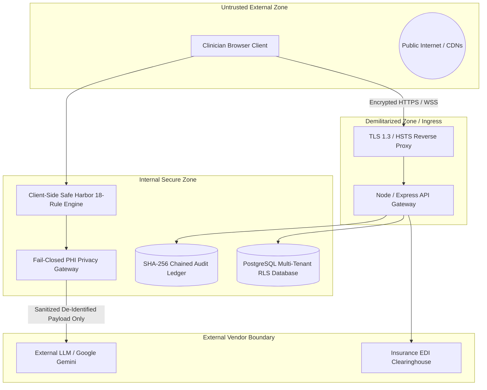

# TheraFlow OS — Security & Privacy Model

> **Notice:** This document details the technical security architecture and threat model of TheraFlow OS.  
> **Compliance Stance:** TheraFlow OS does **not** claim third-party certifications (e.g., SOC 2 Type II or HITRUST CSF certification). Rather, it incorporates defensive architectural patterns specifically engineered to facilitate compliance with the **HIPAA Security Rule (§164.312)** and the **HIPAA Privacy Rule Safe Harbor Standard (§164.514(b)(2))**.

---

## 1. Threat Model & Security Boundaries

TheraFlow OS operates under a defensive healthcare software threat model characterized by four primary trust boundaries:

### 1.1 Key Threat Vectors Analyzed:
1. **Accidental PHI Leakage to External LLMs**: Clinician dictates patient names, phone numbers, or addresses into the ambient scribe, which then get forwarded to third-party AI APIs.
   - *Mitigation*: Client-side pre-processing via `safeHarborRules.ts` combined with an outbound intercepting `phi-privacy-gateway.ts` that fails closed if direct patient identifiers remain in outbound payloads.
2. **Cross-Tenant Data Exposure**: Clinician in Practice A views patient records belonging to Practice B.
   - *Mitigation*: PostgreSQL Row Level Security (RLS) policies enforcing `practice_id = auth.jwt() ->> 'practice_id'` at the database kernel level.
3. **Audit Log Tampering**: Malicious insider alters clinical chart access records or timestamps.
   - *Mitigation*: Cryptographic SHA-256 hash chaining where every log entry includes the hash of the preceding record; modifications break the mathematical integrity of the entire chain.
4. **Delimiter Injection in EHR Export**: Patient clinical notes contain dot-phrases or delimiter characters designed to execute unintended macros in Epic Hyperspace or Cerner.
   - *Mitigation*: Automated dot-phrase escaping and header sanitization in `ehrExportAdapters.ts`.

---

## 2. PHI Data Flow & Privacy Gateway

### 2.1 The 18 HIPAA Safe Harbor Statutory Categories
The local de-identification engine (`src/tools/phi-scrubber/safeHarborRules.ts`) enforces rules for all 18 identifiers enumerated under 45 CFR §164.514(b)(2):
1. Names
2. Geographic subdivisions smaller than a state
3. All elements of dates (except year) and all ages over 89
4. Telephone numbers
5. Fax numbers
6. Email addresses
7. Social Security numbers
8. Medical record numbers (MRNs)
9. Health plan beneficiary numbers
10. Account numbers
11. Certificate/license numbers
12. Vehicle identifiers and serial numbers
13. Device identifiers and serial numbers
14. Web Universal Resource Locators (URLs)
15. Internet Protocol (IP) addresses
16. Biometric identifiers (voiceprints, fingerprints)
17. Full-face photographs
18. Any other unique identifying number, characteristic, or code

### 2.2 Fail-Closed Privacy Gateway Architecture
All outbound requests to external AI models (e.g., Google Gemini in `ai-template-generator.ts` and `ai-note-expander.ts`) pass through `sanitizeForOutboundLlm()`:
- **Pre-Scrub**: The payload is de-identified using Safe Harbor rules.
- **Context Integrity Check**: If explicit patient context (such as the active patient's name, MRN, or phone number) was present in the session, the gateway verifies that these specific strings do not occur in the outbound prompt.
- **Fail-Closed Execution**: If any match is detected, or if an internal regex parser error occurs, the gateway throws `PhiSanitizationError`. Outbound network traffic is aborted immediately, and the application falls back to local deterministic template generation.

---

## 3. Authentication & Authorization Model

1. **Role-Based Access Control (RBAC)**:
   - `clinical_admin`: Full practice configuration, user onboarding, audit export.
   - `supervising_therapist`: Chart review, cosigning clinical notes, supervisor approval for billing.
   - `staff_therapist`: Encounter charting, telehealth sessions, personal schedule management.
   - `billing_specialist`: CMS-1500 claim editing, 837P transmission, superbill generation.
2. **Session Verification**:
   - Server-side subscription verification endpoint (`POST /api/subscription/verify`) validates practice entitlements and active plan status.
3. **Stateless JWT Tokens**:
   - Designed for standard bearer token authorization containing `user_id`, `role`, and `practice_id` claims.

---

## 4. Cryptographic Audit Model (HIPAA §164.312(b))

Audit logs capture all security-relevant clinical events:
- `VIEW_EHR`: Chart reviews.
- `NOTE_CREATE` & `NOTE_SIGN`: Clinical note authorship and signing.
- `TELEHEALTH_SESSION`: Video session start, duration, and completion.
- `SCRUB_EXECUTION`: PHI redaction events.
- `BILLING_EXPORT`: CMS-1500 and 837P claim generation.

### Cryptographic Chaining
Each audit entry generates an immutable SHA-256 fingerprint:
$$\text{Hash}_n = \text{SHA256}(\text{PrevHash}_{n-1} \parallel \text{ID} \parallel \text{Timestamp} \parallel \text{Actor} \parallel \text{Action} \parallel \text{MRN} \parallel \text{IP} \parallel \text{Details})$$
- Logs are durably persisted to an append-only file (`data/audit_ledger.jsonl`).
- The `GET /api/audit-logs/export` endpoint verifies the integrity of the chain before producing tamper-evident exports.

---

## 5. Known Security Limitations & Diligence Disclosures

For transparent buyer diligence, the following items are disclosed:
1. **Regex-Based Local Scrubber Boundaries**:
   - While the regex engine achieved **81.64% overall recall** and **92.18% structured recall** on a challenging 610-snippet blind holdout corpus with 3,410 entities, purely rule-based de-identification can miss subtle, informal unstructured narrative names or complex regional idioms.
   - *Recommendation for Acquirer*: Pair the local rule engine with a secondary BAA-governed enterprise clinical NER model (such as AWS Comprehend Medical or Google Cloud Healthcare NLP API).
2. **Evaluation State Authentication**:
   - In evaluation mode, the frontend supports quick-click demo authentication for frictionless walkthroughs. For production, this demo bypass must be disabled and wired to enterprise SSO/MFA.
3. **No Certification Claims**:
   - TheraFlow OS has not been submitted for official federal or third-party audits. It is a source code and architectural asset, not a certified healthcare institution.
