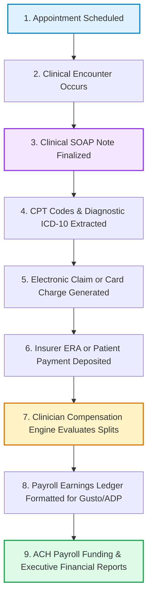

# TheraFlow OS — Unified Practice Ledger & Event Architecture

## 1. The Core Architectural Thesis

The structural flaw in behavioral health SaaS is fragmentation:
- A clinician documents in **SimplePractice** or **TherapyNotes**.
- A medical biller submits claims in **Office Ally** or **Availity**.
- The practice manager exports billing spreadsheets into **Excel** to calculate clinician splits.
- The manager manually types gross pay into **Gusto** or **ADP**.
- The practice owner reviews bank balances in **Chase Business Online** or **QuickBooks**.

Every boundary between these tools requires manual data re-entry, introduces human calculation error, obscures practice unit economics, and creates audit vulnerabilities.

TheraFlow OS operates on a single architectural principle:

> ## **Enter clinical activity once. Everything downstream derives from it.**

---

## 2. The 9-Stage Downstream Pipeline



### Downstream Invariants
A clinician or practice administrator **never** re-enters:
1. Date of service
2. Clinician ID / NPI
3. Client MRN / Demographics
4. CPT code (90837, 90834, 90847, 90791)
5. Encounter duration & Telehealth Place of Service (POS 02/10)
6. Individual vs. Couples vs. Family classification
7. Insurance payer & member policy number
8. Amount billed vs. Allowed vs. Collected

All downstream records maintain foreign key lineage to the originating `encounters.id`.

---

## 3. The 9 Practice-Critical Owner Questions

The Unified Command Center (`src/pages/DashboardHome.tsx`) synthesizes this pipeline to answer the 9 core practice management questions in real time:

| Question | Ledger Source | Real-Time Metric |
|---|---|---|
| **1. What's happening clinically?** | `encounters`, `todayAppointments` | 4 Today (1 Active Telehealth, 98 completed this cycle) |
| **2. What has been billed?** | `claims` (EDI 837) | $34,500 Gross CMS-1500 claims submitted |
| **3. What has been collected?** | `bank_transactions`, `reconciliations` | $42,600 Total ($28.4k Insurance ERA + $14.2k Private Pay) |
| **4. What are clinicians owed?** | `earning_line_items` | $23,430 Accrued clinician compensation |
| **5. What is next payroll?** | `pay_periods` (Oct 1–15, 2026) | $23,430 Gross payable (Pay Date: Oct 20, 2026) |
| **6. Do we have cash to fund payroll?** | `bank_accounts` (Operating Checking) | **Fully Covered** ($78,420 cash = 3.6x payroll coverage) |
| **7. Which claims remain outstanding?** | `payment_reconciliations` (`status: pending_deposit`) | $12,450 Outstanding AR (11.2 day average velocity) |
| **8. Which clinicians are most utilized?** | `workers.weeklyTargetHours` vs. encounters | 86.4% Practice average (Dr. Chen 92%, Dr. Vance 84%) |
| **9. What is the practice's gross margin?** | Unit Economics Waterfall | **$19,170 Gross Margin (45.0%)**, Net Cash Flow +$14,320 |

---

## 4. Event Bus & Idempotency Safeguards

Downstream activity is coordinated through `PracticeEventBus` (`src/modules/ledger/practice-event-bus.ts`).

### Supported Business Events:
- `encounter.completed`
- `claim.created`
- `claim.accepted`
- `payment.received`
- `deposit.matched`
- `compensation.accrued`
- `pay_period.closed`
- `payroll.approved`
- `payroll.submitted`
- `payroll.funded`

### Mathematical Idempotency Guarantee
When clearinghouses retransmit 835 remittance batches or banks re-sync transaction webhooks, duplicate processing is strictly rejected:
```typescript
const event: PracticeEvent = {
  id: "evt-...",
  type: "payment.received",
  practiceId: "practice-demo-1",
  idempotencyKey: `remit-${claimId}-${depositId}-${amount}`,
  payload: { ... }
};
```
If an event matching `idempotencyKey` already exists in `processedIdempotencyKeys`, the event is dropped with a log notice. Clinicians are never double-paid, and deposits are never double-counted.
