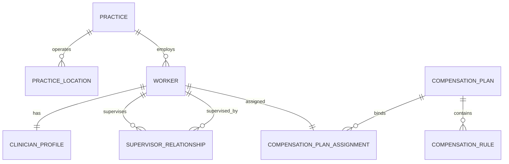

# TheraFlow OS — Workforce & Clinician Compensation Engine Architecture

## 1. Executive Summary

In behavioral health, clinician compensation is notoriously complex, fragmented, and error-prone. Group practice owners typically maintain separate spreadsheets to calculate clinician splits (e.g., 50% for 1–20 sessions, 55% for 21–30 sessions, 60% for 31+ sessions, flat rates for intake evaluations, and distinct rates for couples or family therapy), re-entering clinical data from SimplePractice or TherapyNotes, and manually keying the results into Gusto or ADP.

TheraFlow OS solves this by unifying the workforce roster and compensation engine directly on top of the clinical encounter ledger. Clinician compensation is calculated **deterministically**, **idempotently**, and **auditably** the moment clinical documentation is signed or cash is settled.

---

## 2. Workforce Data Model

The workforce module establishes a first-class behavioral health provider hierarchy:



### 2.1 Entity Classifications
- **Practice & Locations**: Multi-site management with physical clinic locations and virtual telehealth spaces.
- **Workers**: Unified identities with role-based access control (`practice_owner`, `clinical_admin`, `supervising_clinician`, `licensed_clinician`, `associate_clinician`, `intern`, `billing_specialist`, `administrative_assistant`).
- **Employment Classification**: Distinct W-2 Employee vs. 1099 Independent Contractor handling.
- **Clinician Profiles**: State license registry (LMFT, LCSW, LPCC, PsyD, MD), individual Type 1 NPI, taxonomy codes (e.g., `101YM0800X`), and CAQH identifiers.
- **Supervision Linkages**: Mandated clinical supervision relationships for associate clinicians (AMFT, ASW, APCC) tracking weekly required supervision quotas.

---

## 3. Compensation Engine Capabilities

The compensation engine (`src/modules/compensation/compensation-engine.ts`) is a pure, deterministic calculation engine supporting all standard behavioral health compensation models:

### 3.1 Supported Compensation Rule Types
1. **Tiered Volume Splits**:
   - Sessions 1–20: 50%
   - Sessions 21–30: 55%
   - Sessions 31+: 60%
2. **Tiered Collections Splits**:
   - First $5,000 collections: 50%
   - Next $5,000 collections: 55%
   - $10,000+ collections: 60%
3. **CPT-Specific Flat Fees**:
   - Initial Psychiatric Intake (CPT 90791): $125.00 guaranteed flat rate.
   - Couples / Conjoint Psychotherapy (CPT 90847): $110.00 flat rate.
   - Comprehensive Individual (CPT 90837): Percentage or flat rate.
   - Routine Individual (CPT 90834): Percentage or flat rate.
4. **Percentage of Billing / Collections**:
   - % of gross billed charge.
   - % of insurance contracted allowed rate.
   - % of actual cash collected (post-remittance).
5. **Special Encounters & Safeguards**:
   - Late cancellations / billable no-shows: Configurable clinician credit (e.g., $60.00).
   - Unbillable cancellations: $0.00 (non-compensable).
   - Supervision stipends: Flat rate per supervisee/hour.
   - Administrative hourly rates: Charting, peer reviews, care coordination.
   - Documentation promptness bonus: Configurable incentive (e.g., +$10.00) when SOAP note is signed within 24 hours of encounter completion.
   - Monthly minimum income guarantees: Automatic top-up adjustment if monthly earnings fall below guaranteed floor.

---

## 4. Compensation Timing Policies

Compensation rules explicitly declare their accrual timing trigger:

| Policy | Trigger Event | Use Case |
|---|---|---|
| `on_date_of_service` | Clinician signs SOAP note | Flat fee per session, salaried baselines, or associate guarantees |
| `on_claim_acceptance` | Clearinghouse 277CA acceptance | Practices willing to advance on valid claims |
| `on_insurer_remittance` | 835 ERA payment posted | Insurance-heavy practices paying upon electronic remit |
| `on_cash_settlement` | Bank deposit clears | Cash-flow conservative practices paying strictly upon cleared funds |

---

## 5. Auditable Line-Item Explanations

Every earning produced by the engine includes an immutable forensic explanation string stored in `earning_line_items.explanation`. Silent editing of historical earnings is prohibited; any retroactive correction must create an explicit adjustment line item.

**Example Auditable Explanation:**
> `Encounter enc-8472 | CPT 90837 | Cash Collected: $150.00 | Rule: Tier 60% of collections (Session #32 in period) | Clinician earning: $90.00 | Practice retained: $60.00 + $10.00 Documentation Bonus (<24h note completion)`

---

## 6. Integration Contract & Extensibility

The calculation engine is isolated from storage mechanics:
```typescript
export function calculateEncounterCompensation(
  input: EncounterCompensationInput,
  plan: CompensationPlan
): CompensationCalculationResult;
```
Acquirers can substitute custom machine-learning retention incentives or complex joint-venture partner splits by extending `CompensationRuleType` without altering the EHR or billing tables.
